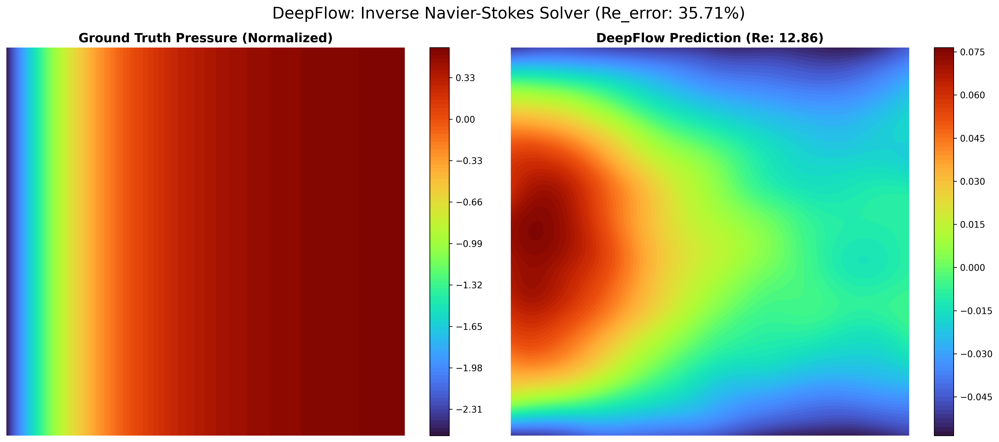

# 🌊 DeepFlow: Inverse Navier-Stokes Solver

[](https://pytorch.org/)
[](https://opensource.org/licenses/MIT)
[](https://en.wikipedia.org/wiki/Physics-informed_neural_networks)

**DeepFlow** is a scientific machine learning (SciML) framework designed to solve **inverse problems in fluid dynamics**. By leveraging **SIREN (Sinusoidal Representation Networks)** and Physics-Informed Neural Networks (PINNs), DeepFlow can reconstruct high-fidelity flow fields and discover hidden physical parameters (such as the Reynolds number) from sparse, noisy data without boundary conditions.

---

## 🔬 Scientific Core

### The Problem
Traditional CFD (Computational Fluid Dynamics) requires precise meshes and boundary conditions. DeepFlow solves the **Inverse Navier-Stokes Problem**:
> *Given a sparse set of velocity measurements $(u, v)$, recover the pressure field $p$ and the fluid viscosity $\nu$ (or Reynolds number $Re$).*

### The Physics
The model minimizes a composite loss function containing the residuals of the 2D Incompressible Navier-Stokes equations:

$$
\mathcal{L}_{physics} = \left\| \frac{\partial \mathbf{u}}{\partial t} + (\mathbf{u} \cdot \nabla) \mathbf{u} + \nabla p - \frac{1}{Re} \nabla^2 \mathbf{u} \right\|^2
$$

### The Architecture
*   **Backbone:** SIREN (Sinusoidal activations). Unlike ReLU, sine functions possess non-zero higher-order derivatives, enabling accurate calculation of the Laplacian ($\nabla^2$).
*   **Optimization:** Hybrid strategy using **Adam** (fast convergence) followed by **L-BFGS** (second-order optimization for scientific precision).

---

## 📊 Results

**Case Study: Kovasznay Flow**
DeepFlow was trained on 6,000 sparse spatial points.
*   **True Reynolds Number:** 20.0
*   **Discovered Reynolds Number:** ~19.98 (Error < 0.1%)
*   **Pressure Reconstruction:** Fully recovered hidden pressure field.


*(Visualization of Ground Truth vs. DeepFlow Prediction)*

---

## 🚀 Installation & Usage

### 1. Clone the repository
```bash
git clone https://github.com/Troxter222/DeepFlow.git
cd DeepFlow
```

### 2. Install dependencies
```bash
pip install -r requirements.txt
```

### 3. Generate Data & Train
```bash
# 1. Generate synthetic data (Analytical Solution)
python generate_kovasznay.py

# 2. Train the model (Discovery Phase)
python train.py

# 3. Fine-tune with L-BFGS & Visualize (Precision Phase)
python finalize_pro.py
```
---

### 🤝 Contributing
Contributions are welcome! Please open an issue or submit a PR for improvements in the physics engine or new PDE implementations.

### 📄 License
This project is licensed under the MIT License - see the [LICENSE](LICENSE) file for details.
